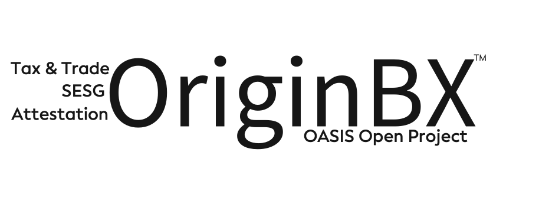

<h1>OriginBX Project Governing Board (PGB)</h1>

The Project Governing Board sets overall strategic direction for the OriginBX project and formally approves released work products.
 
  

PGB members include representatives of <a href="https://github.com/originbx-oasis/oasis-open-project/blob/main/SPONSORS.md">OriginBX sponsor organizations</a> and representatives from the community at-large who serve on the Technical Steering Committee.

<i>PGB Co-Chairs</i>: Todd R. Smith, Linda Cheung

PGB members:

<iframe src="https://docs.google.com/spreadsheets/d/e/2PACX-1vT38MUZFWO1ISzQWC6wSulN7IJCmYdSOIxBiofgO4c8mRF0hOuLEO59bW6McK2Lm0DgJkpaPLAf38AI/pubhtml?gid=1502721957&amp;single=true&amp;widget=true&amp;headers=false" style="border-style: none; width: 500px; height: 400px" title="OriginBX Project Governing Board members"></iframe>

  

For information on sponsoring these projects or joining the governing board, please contact <a href="mailto:communications@oasis-open.org">communications@oasis-open.org</a>.

